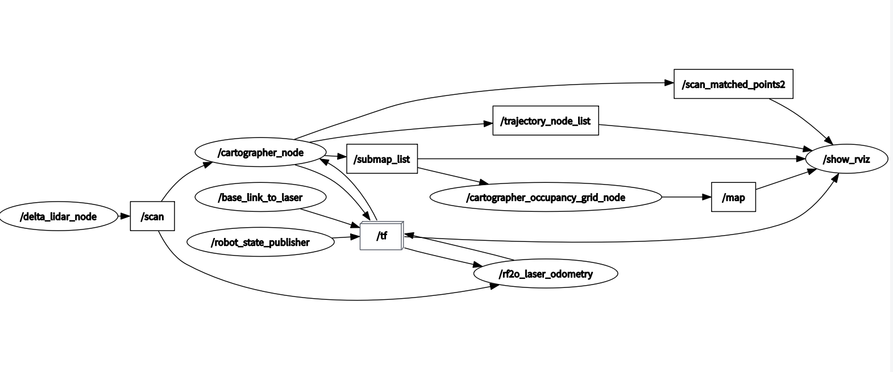

# SlamRobot
2021 年 robo-master 自动步兵机器人

## 预期目标
1. 实时生成 2d 栅格地图，保存地图，加载现有的地图。
2. 自主规划运动路径，在遇到动态障碍物时重新决策。
3. 根据外部指令调整运动策略。

## 可用传感器
- 2D 雷达(思岚 `Delta2a`)
- 双目相机(待定)
- UWB

## 主要结构
1. 建图和定位：`Cartographer`, `OpenVSLAM`(备选)
2. 里程计：目前 `main` 分支使用的是 `rf2o_laser_odometry` 里程计，仅使用雷达数据。实践证明基于雷达的里程计精确度不高，目前仅供调试使用。
3. 路径规划：`ROS Navigation`(筹)。思路梳理：[navigation](./docs/navigation.md)
4. 仿真环境：`V-REP`(筹)

## 拓扑图（更新于：2021/01/02）

## 开发进度
- 2020/12/02 首次提交
- 2020/12/14 可生成 2D 栅格地图
- 2020/12/19 地图可保存和加载
- 2020/01/02 雷达里程计已经可用

（计划）

- 2020/01/02 完成路径规划原型
- 2020/01/09 完成仿真环境，完善里程计和局部避障

## 参考资料
- [reference](./docs/reference.md)
