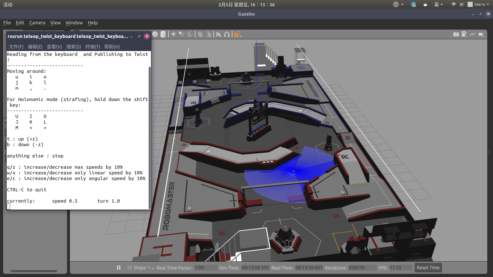

# SlamRobot
2021 年 robo-master 自动步兵机器人

## 使用手册
- [manual](./docs/manual.md)

## 预期目标
1. 实时生成 2d 栅格地图，保存地图，加载现有的地图。
2. 自主规划运动路径，在遇到动态障碍物时重新决策。
3. 根据外部指令调整运动策略。

## 可用传感器
- 2D 雷达(思岚 `Delta2a`)
- 双目相机(待定)
- UWB

## 主要结构
1. 建图和定位：`Cartographer`, `OpenVSLAM`(备选)
2. 里程计： 目前使用纯轮式里程计。
3. 路径规划：`ROS Navigation`。思路梳理：[navigation](./docs/navigation.md)
4. 仿真环境：`Gezebo`。思路梳理：[gazebo](./docs/gazebo.md)

## 拓扑图（更新于：2021/01/02）

## 仿真场景图（更新于：2021/02/05）

蓝色部分为雷达发射光迹。

## 开发进度
- 2020/12/02 首次提交。
- 2020/12/14 可生成 2D 栅格地图。
- 2020/12/19 地图可保存和加载。
- 2021/01/02 雷达里程计已经可用。
- 2021/01/03 路径规划原型已完成（暂时没法测试，可用性未知）。
- 2021/01/07 路径规划经小范围测试未发现问题。
- 2021/01/07 串口通讯部分主体已完成，具体数据格式待定。
- 2021/01/16 轮式里程计初步完成，尚未测试。
- 2021/02/05 仿真环境取得阶段性进展，主要部件全部完成。
- 2021/02/09 仿真环境完成，建图（cartographer）测试效果良好，导航（move_base）测试效果良好。
- （计划）
- 完善路径规划（考虑车体尺寸，雷达误差）
- 保存、加载 cartographer 私有格式地图
- 在已知地图中确定位置(方案：1. cartographer 2. amcl)
- 预设运动策略
- 确定串口通讯协议
- 云台控制策略
- 对接自瞄，雷达站
- 接入双目相机
- 使用点云数据局部避障
- 融合里程计（双目相机 + 轮子转速）

## 参考资料
- [reference](./docs/reference.md)

